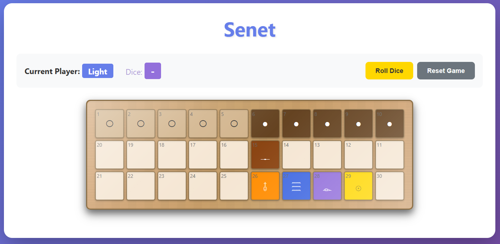

### Prerequisites

- Rust (latest stable version)
- `wasm-pack` - Install with: `cargo install wasm-pack`

### Build Steps

1. Build the WebAssembly module:
```bash
wasm-pack build --target web
```

2. Serve the files with a local web server (required for WebAssembly):
```bash
# Using Python
python -m http.server 8000

# Using Node.js
npx serve

# Using PHP
php -S localhost:8000
```

3. Open `http://localhost:8000` in your browser.


# Game Rules
Be the first player to move all five of your pieces off the board (beyond square 30).

### Setup
- **Light Player**: Starts with 5 pieces on squares 1-5 (left side of the board).
- **Dark Player**: Starts with 5 pieces on squares 6-10 (right side of the board).
- **Starting Player**: Light player goes first.
- **Board Layout**: 30 squares arranged in three rows:
  - Row 1: Squares 1-10 (left to right)
  - Row 2: Squares 11-20 (right to left, reversed)
  - Row 3: Squares 21-30 (left to right)

### Turn Sequence

1. **Roll the Dice**: Click "Roll Dice" to get a value from 1-4 (simulating ancient throwing sticks).
2. **Select a Piece**: After rolling, valid pieces will be highlighted in green.
3. **Make a Move**: Click on one of your highlighted pieces to move it forward by the dice value.
4. **End Turn**: After moving, the turn automatically passes to your opponent.

### Movement Rules

- **Forward Movement Only**: Pieces always move forward (toward square 30).
- **Exact Roll to Exit**: To move a piece off the board, you must roll the exact number needed to reach or exceed square 30.
- **Blocking**: You cannot land on a square occupied by your own piece.
- **No Valid Moves**: If you roll but have no valid moves, your turn automatically passes after 1 second.
- **Must Move**: If you have a valid move, you must make it (you cannot pass voluntarily).

### Special Squares

The board contains several special squares with unique properties:

1. **Square 15 - Safe House** 🟢
   - Protected square that provides safety.
   - Pieces on this square cannot be captured by opponents.

2. **Square 26 - House of Happiness** 🟣
   - A safe landing square.
   - Pieces landing here are protected.

3. **Square 27 - House of Water** 💧
   - **Danger Zone**: Landing here sends your piece back to the start!
   - The piece is returned to the first available empty square in your starting area (squares 1-10 for Light, 6-15 for Dark).
   - **Important**: You cannot enter this square if it's already occupied.
   - Your turn ends immediately after landing here.

4. **Square 28 - House of Three Truths** 🟠
   - A safe landing square.
   - Provides protection for pieces.

5. **Square 29 - House of Re-Atum** 🔴
   - The final square before exiting the board.
   - From here, you need to roll exactly 1 to exit.

### Capturing Opponent Pieces

- **Landing on Opponent**: If you land on a square occupied by an opponent's piece, you **capture** it.
- **Capture Effect**: The opponent's piece is sent back to their starting area (first available empty square in squares 1-10 for Light, 6-15 for Dark).
- **Your Piece Stays**: Your piece remains on the captured square.
- **Exception**: Safe houses and special squares cannot protect pieces from capture (except square 15 which is a Safe House).

### Winning the Game

- **Victory Condition**: Move all five of your pieces off the board (beyond square 30).
- **Game End**: The game ends immediately when one player has no pieces remaining on the board.
- **Winner**: The player who successfully moves all pieces off the board wins.


# Senet - Ancient Egyptian Board Game

One of the oldest known board games, dating back to ancient Egypt (around 3100 BCE). The game was played on a board of 30 squares arranged in three rows of ten. Players move pieces based on dice throws, with special rules for certain squares.

Senet means passing in ancient Egyptian, referring to the soul's passage through the underworld. This name reflects the game's deeper spiritual purpose beyond mere entertainment.

### Evolution

The game evolved significantly over time:
- **Early Period**: Started as a simple pastime and recreational activity.
- **Later Period**: Gained profound religious significance, becoming a symbolic representation of the afterlife journey.
- The transformation from game to ritual object demonstrates how deeply embedded Senet became in Egyptian funerary practices.

### Symbolic Elements

The game's design mirrors the journey through the afterlife:

- **The 30 Squares**: Represent stages and challenges the soul must face in the underworld.
- **Moving Forward**: Each move forward symbolizes the soul's progress through the underworld, overcoming obstacles and trials.
- **Special Squares**: 
  - The **"House of Water"** (square 27) represents dangerous waters that can send the soul back.
  - The **"House of Happiness"** (square 26) and other special squares mirror safe havens and significant milestones on the journey.
  - These squares reflect the trials and rewards described in Egyptian funerary texts.

### Funerary Context

Senet held such importance that it was included in burial practices:

- **Tomb Placement**: Senet boards were placed in tombs, including that of **Tutankhamun**, to help the deceased navigate the afterlife.

- **Tomb Paintings**: Ancient artwork, such as the paintings in **Queen Nefertari's** tomb, depict the game being played, emphasizing its critical role in funerary beliefs.

- **Spiritual Tool**: The game served as both entertainment in life and a guide for the soul's journey after death.

This dual nature—as both a game and a spiritual practice—makes Senet unique among ancient board games, representing the intersection of play, religion, and the human quest to understand what lies beyond death.


# Project Structure

```
.
├── Cargo.toml          # Rust project configuration
├── src/
│   └── lib.rs          # Main game logic
├── index.html          # Web interface
├── style.css           # Styling
├── index.js            # JavaScript bindings
└── README.md           # This file
```
